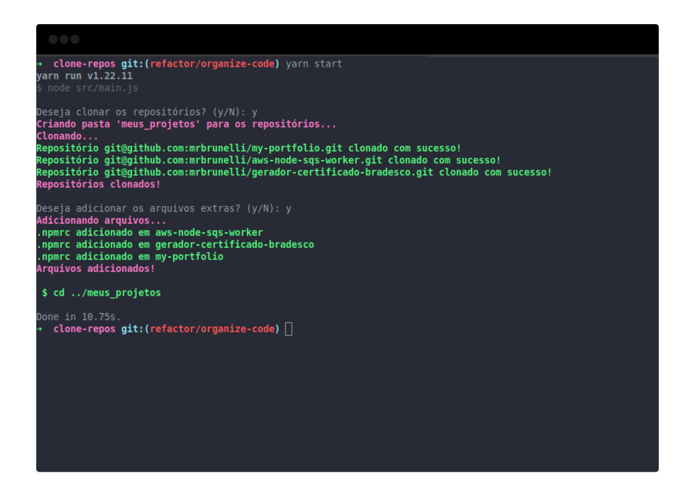

## Node.js automation script for repositories clone

### Example
Set your repositories url and extra files to add after clone
```json
{
  "folder_name": "meus_projetos",
  "repositories_url": [
    "git@github.com:mrbrunelli/my-portfolio.git",
    "git@github.com:mrbrunelli/aws-node-sqs-worker.git",
    "git@github.com:mrbrunelli/gerador-certificado-bradesco.git"
  ],
  "additional_files": [
    {
      "name": ".npmrc",
      "content": "//registry.npmjs.org/:_authToken=my_npm_token"
    }
  ]
}
```

### How execute
```sh
# Needs Node.js v14+
yarn start || npm start
``` 

### Screenshot
